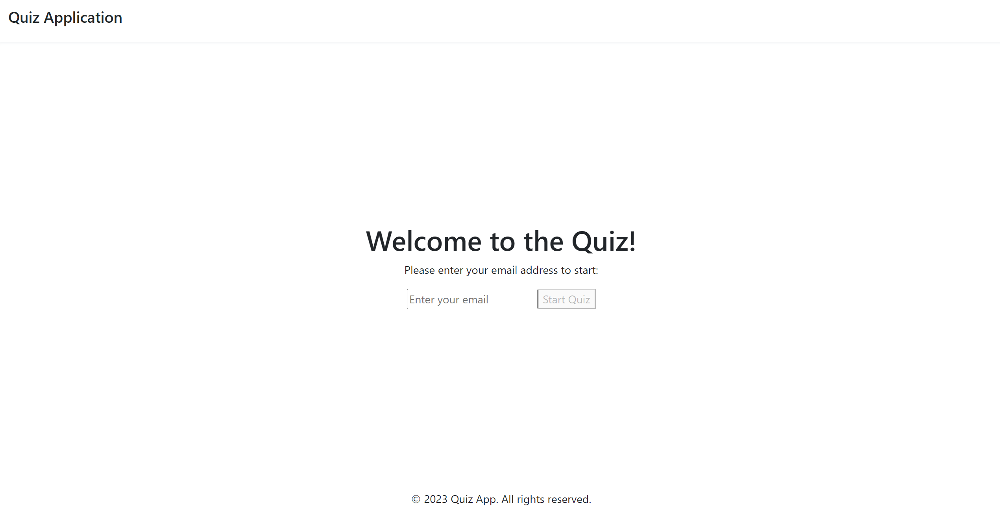
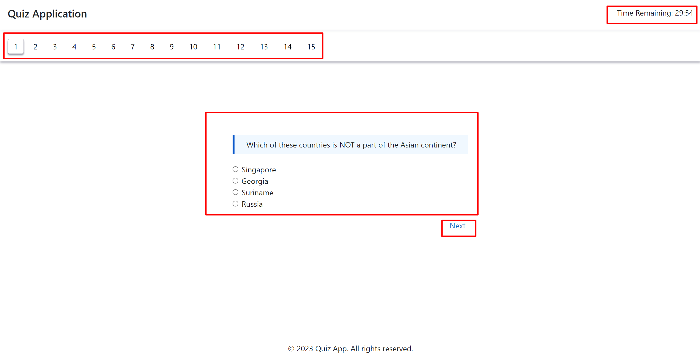
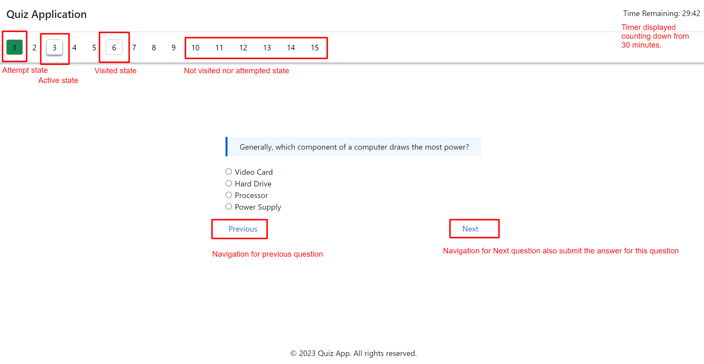
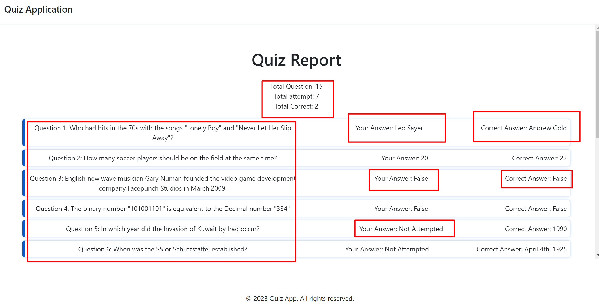

This project create with [Create React App](https://github.com/facebook/create-react-app).

# Quiz Appp - React.js App

- Test [LIVE][appHost] Demo!

## Usage
Start the development server:
- npm start
- Access the application in your web browser at http://localhost:3000.
- Take a quiz, answer questions, and navigate through the quiz.
- In last, will get report page for how many you attempted or right answer with a proper report should display each question with the user's answer and the correct answer side by
  side or in a format that is easy to compare.

## 📜 Overview

In this tutorial, we will be exploring a **Quiz App**. Developed with React.js. The key features that we will be exploring:

- Local State Management using [Hooks][hooks]
- 
*_ Hooks are involved in every operation that is taking place in the App _*

## 💻 Pre-requisites
- Basics Knowledge about HTML, CSS & JavaScript
- [Node.js][nodejs] must be installed
- Redux (for state management)
- styled-components (for styling)

## Why Hooks are Used?

- Hooks are new to React.js `v16.8`
- Let's you use **State** & features like **Lifecycle Methods** without writing a `class`
- Reduce the number of concepts you need to juggle while writing React apps.
- Reduce the constant switching between functions, classes, higher-order components & allows the preference of `functions`.

## Why & How Hooks are used?

## Why!
We are using Hooks to managing the local state of our app, which includes very minimalist features like:
- Managing the state of all quiz data point easily
- MManipulate or update data using dispatch doing easily and simpler
- State in Quiz app Component etc.

## Set Up Your Project:
Assuming you have Node.js installed, you can create a new React app using create-react-app. Open your terminal and run:
- npx create-react-app quiz-app
- cd quiz-app

## Fetching Questions from API:
In your src folder, create a new file called api.js to handle API requests:

- A function fetchQuestions that is responsible for making an HTTP request to a specified API endpoint (API_URL) to fetch a set of quiz questions.
- `const API_URL = "https://opentdb.com/api.php?amount=15";` 
- it's the Open Trivia Database API, and you're requesting 15 questions `(?amount=15)`.
- It's marked as async because it performs asynchronous operations like making HTTP requests.
- This begins a try-catch block, which is used to handle any errors that may occur during the execution of the code within the try block.
- `const data = await response.json();` uses the json() method to parse the response body as JSON. The await keyword is used here as well to wait for the parsing to complete.
- In summary, this code defines a function fetchQuestions that fetches quiz questions from a specified API endpoint and handles any potential errors that may occur during the process. When used in your application, you can call this function to retrieve quiz questions and work with the returned data as needed.

```js
const API_URL = "https://opentdb.com/api.php?amount=15";

export const fetchAPIForData = async () => {
  try {
    const response = await fetch(API_URL);
    const data = await response.json();
    return data.results;
  } catch (error) {
    console.error("Error fetching questions:", error);
    return [];
  }
};
```

## In app component:
Header, main and footer define here, using useEffect call the api from here when render first time and assign all questions data in redux initial state using redux

```js
export const App = () => {
  return (
          <div className="app">
            <header className="app-header">
              <h1>Quiz Application</h1>
              {isStartQuiz &&
                      <Timer timer={timer} />
              }
            </header>
            <main>
              <StartPage />
            </main>
            <footer className="app-footer">
              <p>© {new Date().getFullYear()} Quiz App. All rights reserved.</p>
            </footer>
          </div>
  );
}
```
- using useEffect update the time interval - code below

```js
useEffect(() => {
  let timerInterval;
  if (isStartQuiz) {
    timerInterval = setInterval(() => {
      if (timer > 0) {
        dispatch(tickTimer());
      } else {
        clearInterval(timerInterval);
        dispatch(setStartValue(false));
        dispatch(setEndValue(true));
      }
    }, 1000);
  }

  return () => clearInterval(timerInterval);
}, [timer, dispatch, isStartQuiz]);
```

## Screenshot of the App Page


## Create Components:
Inside the src folder, create components for your application:

- `components/Timer.js:` Display and manage the timer.

   Reusable timer display component that you can incorporate into your React application to show the remaining time for a quiz or any other timed activity. When you use this component in your application, you should pass the timer prop with the number of seconds remaining for the countdown.

- `components/StartPage.js:` Display the StartPage component and  should have a start page where the user should submit their email address.
  
   `const emailRegex = /^[a-zA-Z0-9._%+-]+@[a-zA-Z0-9.-]+\.[a-zA-Z]{2,}$/;` using this regex validating for email and start the Quiz.

- `components/QuizPage.js:` Display and define quiz component for which application should display 15 questions to the user and continue with navigation.

## Implement the Quiz Logic:

- Display quiz questions with multiple-choice options.
- Allow users to select answers and navigate between questions and this all state manage by redux that we are using.
    
- Track user progress in `Overview Panel` and save answers in `Redux using action and dispatcher`.

## Quiz start screenshot and state defines
Display quiz questions with multiple-choice options and their states



## Quiz start screenshot and state defines
- Submit the quiz and view results.



## Challenges faced and solution

- State Management:
  `Challenge`: Managing the application's state, including user answers, current question, timer, which question visited and attempted and the navigate and save the result can become complex as the app.<br/>
  `Solution`: Consider using Redux or React Context to centralize state management. Create clear, modular reducers to manage different aspects of the app's state

- Timer Implementation:

  `Challenge`: Implementing a timer that counts down and auto-submits the quiz can be challenging, especially handling interruptions.<br/>
  `Solution`: Use setInterval to manage the timer. Handle tab/window switches by listening to the Page Visibility API events.

- Responsive Design:

  `Challenge`: Making the app responsive and ensuring it works well on different screen sizes and devices can be time-consuming.<br/>
  `Solution`: Use CSS frameworks like Styled components or CSS flex/Grid to simplify responsive design. Test the app on various devices and browsers to ensure compatibility.

- Error Handling:

  `Challenge`: Handling errors gracefully, such as network errors when fetching questions or unexpected runtime errors, is crucial.<br/>
  `Solution`: Implement error handling mechanisms, like try-catch blocks for network requests. Display user-friendly error messages when something goes wrong.

- Performance Optimization:

  `Challenge`: Ensuring that the app performs well, even with a large number of questions, can be a concern.<br/>
  `Solution`: Profile the app's performance with tools like React DevTools and address bottlenecks by optimizing render cycles, using memoization, and avoiding unnecessary re-renders.

- Deployment:

  `Challenge`: Deploying the app to a hosting platform and configuring it for production can be a challenge.<br/>
  `Solution`: Use hosting services like Netlify, Vercel, or GitHub Pages. Configure environment variables, optimize assets, and set up CI/CD pipelines for automated deployments.

```text
Each challenge can be overcome with careful planning, coding, and sometimes, a bit of research. Building a quiz app in React is a great project for improving your development skills, and overcoming these challenges will help me become a better developer.
```

## Author

#### Raghvendra Modanwal
[](https://www.linkedin.com/in/iamraghav/)


Copyright (c) 2023 CB

[hooks]: https://reactjs.org/docs/hooks-intro.html
[nodejs]: https://nodejs.org/en/
[appHost]: https://rm-quiz-app07.netlify.app/
